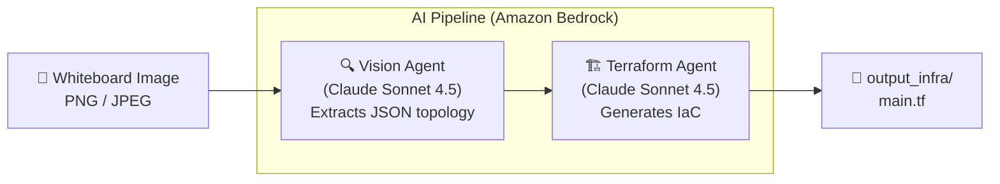

# Whiteboard to Infrastructure

Snap a photo of your whiteboard architecture diagram and get production-ready Terraform — in seconds.

---

## Demo

<video src="https://github.com/user-attachments/assets/f4492120-a98d-4f9f-97df-8d70c57a2fa9" controls width="100%"></video>

---

## How It Works



Two agents work in sequence:

1. **Vision Agent** — reads your image and extracts AWS resources + connections as structured JSON.
2. **Terraform Agent** — turns that JSON into a complete `main.tf` with security best practices applied.

---

## Prerequisites

| Requirement | Notes |
|---|---|
| Python 3.10+ | `python --version` |
| AWS account | Bedrock access enabled |
| Bedrock model access | Grant `claude-sonnet-4-5` in the [Bedrock console](https://console.aws.amazon.com/bedrock) |
| AWS credentials | `aws configure` or env vars (`AWS_ACCESS_KEY_ID`, `AWS_SECRET_ACCESS_KEY`) |
| IAM permission | `bedrock:InvokeModel` on your principal |
| Terraform ≥ 1.9 | Only needed to *apply* the generated code |

---

## Quickstart

```bash
# 1. Clone & enter the project
git clone <your-repo-url>
cd whiteboard-to-infra

# 2. Create a virtual environment
python -m venv .venv
source .venv/bin/activate        # Windows: .venv\Scripts\activate

# 3. Install dependencies
pip install -r requirements.txt

# 4. Run it
python main.py --image examples/sample_1/event_driven_architecture.png
```

The generated Terraform lands in `output_infra/main.tf`.

---

## Configuration

Override defaults with environment variables:

| Variable | Default | Description |
|---|---|---|
| `BEDROCK_MODEL_ID` | `us.anthropic.claude-sonnet-4-5-20250929-v1:0` | Bedrock model to use |
| `AWS_REGION` | `us-east-1` | AWS region |

---

## Apply the Generated Terraform

```bash
cd output_infra
terraform init
terraform plan
terraform apply
```

The tool will:
1. Send your image to the **Vision Agent** to extract an AWS topology in JSON
2. Pass that topology to the **Terraform Agent** to generate the full IaC project
3. Write all output files to the `output_infra/` directory

### Output

After a successful run, `output_infra/` will contain:

| File | Contents |
|---|---|
| `providers.tf` | AWS provider config with `default_tags`, no hardcoded credentials |
| `variables.tf` | All input variables with types, descriptions, and safe defaults |
| `main.tf` | Resource definitions grouped by tier (networking, compute, data, etc.) |
| `outputs.tf` | IDs, ARNs, and endpoints exposed after `terraform apply` |
| `README.md` | Architecture overview, Mermaid diagram, usage guide, and security notes |

---

## Deploying the Generated Terraform

```bash
cd output_infra

# Initialize providers
terraform init

# Preview changes
terraform plan -var="environment=dev" -var="project_name=my-project"

# Apply
terraform apply -var="environment=dev" -var="project_name=my-project"
```

---

## Configuration

| Environment Variable | Default | Description |
|---|---|---|
| `BEDROCK_MODEL_ID` | `us.anthropic.claude-sonnet-4-5-20250929-v1:0` | The Bedrock model used by both agents |
| `AWS_REGION` | `us-east-1` | AWS region for Bedrock API calls |

Override at runtime:
```bash
BEDROCK_MODEL_ID="us.anthropic.claude-opus-4-..." AWS_REGION="eu-west-1" python main.py --image diagram.png
```

---

## Project Structure

```
whiteboard-to-infra/
├── main.py                  # Pipeline entrypoint — orchestrates both agents
├── requirements.txt
├── agents/
│   ├── vision_agent.py      # Vision Agent: image → JSON topology
│   └── terraform_agent.py   # Terraform Agent: JSON topology → IaC files
├── core/
│   ├── config.py            # Model ID and region config
│   └── logger.py            # Shared logger
├── examples/
│   └── sample_1/            # Sample architecture images to test with
└── output_infra/            # Generated Terraform files land here
```

---

## Security Defaults in Generated Code

The Terraform Agent is instructed to enforce production-grade security out of the box:

- **No hardcoded credentials** — provider uses IAM roles or environment variables
- **Encryption at rest** — `encrypted = true` on EBS, RDS, ElastiCache; KMS keys where applicable
- **Encryption in transit** — HTTPS listeners enforced, TLS on databases
- **Least-privilege IAM** — policies scoped to specific resource ARNs, no wildcard actions
- **S3 hardening** — `aws_s3_bucket_public_access_block` with all four settings enabled
- **Security groups** — no `0.0.0.0/0` ingress except public-facing ALB on port 443

---

## Supported Image Formats

`PNG`, `JPEG` / `JPG`

The image should clearly show AWS service names or recognizable icons and the connections between them. Whiteboard sketches, digital diagrams, and exported architecture diagrams all work well.

---

## Tech Stack

- **[Strands Agents](https://github.com/strands-agents/sdk-python)** — Agent framework powering both Vision and Terraform agents
- **[Amazon Bedrock](https://aws.amazon.com/bedrock/)** — Managed foundation model API (Claude)
- **[boto3](https://boto3.amazonaws.com/v1/documentation/api/latest/index.html)** — AWS SDK for Python
- **[Terraform](https://www.terraform.io/)** — Target IaC format for the generated output
